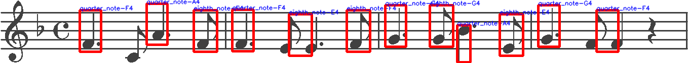
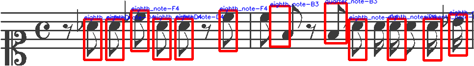
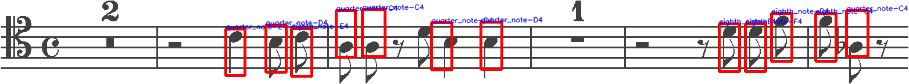

# OMR---Optical-Music-Recognition

This is a simple OMR project. Check out the PDF paper for the steps.

you need the following libraries:
    * OpenCV
    * MIDIUtil
    * Numpy
    * matplotlib
